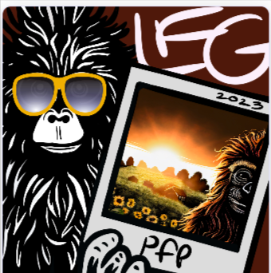

# 🐵 Yeti Apes Explorers Project Overview

Yeti Apes are a token-gated collective of web3 and NFT enthusiasts focused on fostering authentic connections while learning to build web3 projects.

Explorers connect with a Yeti Ape Buddy and are empowered to learn web3 by working together organized in Discord.

## Drop Mechanics

Total of 1111 Yeti Ape Explorers will be dropped on the Ethereum blockchain for .02 eth each on March 15, 2023.

Participants mint directly from the Yeti Apes Explorers website. Traits and information revealed in the metadata will move holders into cohorts in the Discord.

1. Generative NFT collection (pfp)
2. Open or Limited Edition Claim
3. AI pfp Collection
4. Web3 dApp

We will include different mentors in the future with different skillsets.  Corresponding Channels will be established in Discord.

#### 1. PFP

A pfp project will be a generative collection&#x20;

#### 2. aDapp

#### .png>)

#### 3. Open Edition&#x20;

.png>)

## Background Color

We can use traits to randomly assign participants to groups, and will broadly determine the type of project they will be expected to complete.&#x20;

### Background = chain you will be working on. &#x20;

Participants meet in Discord where facilitators guide them to create their own web3 project governed by sovereign smart contracts deployed to a blockchain (Ethereum or Tezos).&#x20;

### "Photo" = you get a buddy!&#x20;

.png>)

## Weekly Listening Circles

#### The Idea here is to facilitate a Weekly Yeti Apes Listening Circle over Twitter Spaces for 90 minutes as a cornerstone of the program.&#x20;

#### This is how we can intentionally strengthen connections between participants.&#x20;

1. **Introduction: we will clearly communicate the purpose and guidelines for the listening circle:** Before the listening circle begins, we will let participants know that the focus of the circle is on supportive, active listening and creating a safe space to get to know each other.
2. **2-minute shares:** Yetis are invited to share for two minutes on any topic they choose while everyone else actively listens.
3. **Using the "hands up" feature:** Twitter Spaces includes a "hands up" feature that allows participants to signal that they would like to speak. This can help to ensure that everyone who wants to share has an opportunity to do so, and can also help to prevent interruptions or overlapping conversations. Each speaker is given the floor for a max of two minutes.
4. **Encourage participants to practice active listening:** Remind participants to practice active listening by paying attention to what others are saying. They will be given an opportunity to reflect back what they have heard to show understanding.
5. **Invite Yetis to recreate what the speaker shared:** The facilitator will call on a Yeti with their hand raised to repeat what the speaker shared, in their own words. If the speaker gives a Thumbs Up, we will move to the next volunteer speaker. If the Speaker Gives a Thumbs Down, we will give the floor to another Yeti listener to try to see if they can demonstrate they understood what the speaker shared.&#x20;
6. **Monitor the conversation and provide support as needed:** As facilitators, we will want to keep an eye on the conversation and make sure that it stays on track and that participants are feeling supported. If we notice any issues or concerns, we will be prepared to step in and offer support or guidance as needed.
7. **Optional'  end the listening circle with a closing activity:** At the end of the listening circle, include a closing activity, such as a group reflection or a guided meditation, to help participants process their thoughts and feelings and bring the circle to a close.

## Incentivizing Participation

Yeti Apes in the audience can be rewarded for attending, speaking, listening and reflecting back what they heard.  &#x20;

All in attendance will be airdropped a POAP at the end. Ideally created live and inspired by the Spaces.&#x20;

#### Additional ideas to incentivize full participation:

Any Yeti in attendance who shares (must raise hand to share) is awarded 'points' TBD.&#x20;

Any Yeti who raises hand to volunteer to reflect back what was shared by the speaker, should also be awarded points.

## To kick off a project, a team leader submits an outline to be approved by project facilitators (jlove, quantic, vero)

Project outline needs to include the following:&#x20;

* Name of Cohort
* Type of Project: (see polaroid photo)
* Title of Group Project:
* By when does the team anticipate completing the project? (ideal timeframe no more than 6 weeks)
* What evidence do you have to support that your project is wanted or needed in the Web3 space?&#x20;
* What specific strengths does your team bring?&#x20;
* Where does the team think they will be most challenged to complete the project?&#x20;

### Cohort / Team Leader

It may be helpful to request one person volunteer to be the **team leader** who communicates with us weekly on the status of the project.  Or we can have say 1 or every 10 minted be identified as a Team Leader. I like the idea of people "getting"  the leadership trait randomly assigned.&#x20;
